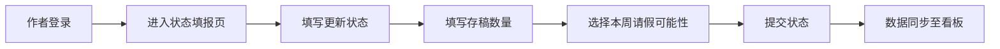
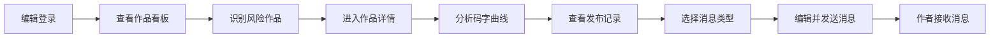
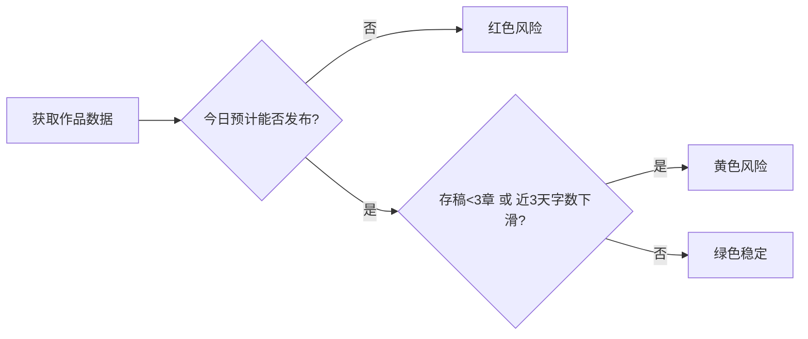

## 1. 产品概述

面向网文平台编辑和签约作者的协同工作台，解决作者快断更时编辑看不见、催更太晚的核心痛点。通过作者每日状态上报与编辑端风险可视化，实现中腰部连载作品的精细化运营维护。

- 目标用户：网文平台签约作者、平台责任编辑
- 核心价值：提前识别更新风险，智能推送个性化催更建议，降低断更率

## 2. 核心功能

### 2.1 用户角色

| 角色 | 登录方式 | 核心权限 |
|------|----------|----------|
| 作者 | 账号登录 | 填写每日更新状态、存稿数量、本周请假可能性，查看编辑消息 |
| 编辑 | 账号登录 | 查看作品风险看板、作品详情、发送个性化催更消息 |

### 2.2 功能模块

1. **作品看板**：作品列表、红黄绿风险标识、搜索筛选
2. **作品详情**：七日码字曲线、发布时间记录、请假说明、消息发送
3. **作者状态填报**：更新状态、存稿数量、请假可能性、每日字数
4. **消息中心**：消息列表、消息详情、消息状态管理

### 2.3 页面详情

| 页面名称 | 模块名称 | 功能描述 |
|-----------|-------------|---------------------|
| 作品看板 | 风险统计卡片 | 展示红黄绿风险作品数量统计 |
| 作品看板 | 作品列表 | 按风险等级排序展示作品，支持搜索和筛选 |
| 作品看板 | 作品卡片 | 展示作品名称、作者、风险等级、最新状态、存稿数量 |
| 作品详情 | 基础信息区 | 作品封面、名称、作者、分类、状态 |
| 作品详情 | 码字曲线图 | 最近七天每日码字数量折线图 |
| 作品详情 | 发布时间线 | 最近七天实际发布时间记录 |
| 作品详情 | 请假说明 | 作者提交的请假计划和说明 |
| 作品详情 | 消息发送区 | 温和提醒、补更建议、沟通预约三种消息模板 |
| 作者填报页 | 状态表单 | 今日更新状态、存稿数量、本周请假计划 |
| 作者填报页 | 历史记录 | 最近七天填报历史 |
| 消息中心 | 消息列表 | 按时间倒序展示所有消息 |
| 消息中心 | 消息筛选 | 按类型、已读/未读筛选消息 |

## 3. 核心流程

### 3.1 作者端流程

作者登录后进入状态填报页，填写今日更新状态、存稿数量，如有请假计划则填写说明，提交后数据同步至编辑端看板。

### 3.2 编辑端流程

编辑登录后进入作品看板，查看红黄绿风险作品列表，点击高风险作品进入详情页，分析码字曲线和发布记录，选择合适的消息模板发送给作者。

### 3.3 风险判定逻辑

## 4. 界面设计

### 4.1 设计风格

- **主色调**：深沉书墨蓝 (#1e3a5f) 作为主色，代表专业与稳重
- **辅助色**：风险三色系统 - 绿色 (#10b981)、黄色 (#f59e0b)、红色 (#ef4444)
- **点缀色**：暖金色 (#d4a574) 用于强调和装饰，呼应网文出版气质
- **字体**：标题使用「思源宋体」体现文学气质，正文使用「Inter」保证可读性
- **布局风格**：卡片式布局，左侧导航 + 右侧内容区，信息密度适中
- **按钮风格**：圆角 8px，微阴影，悬停有缩放和阴影加深效果
- **图标风格**：使用 Lucide 线性图标，统一 24px 尺寸

### 4.2 视觉氛围

整体采用「编辑工作台」风格，背景使用柔和的米白色渐变搭配细微的纸张纹理，营造专业而不冰冷的办公氛围。卡片使用白色背景 + 细微投影，边框 1px 浅灰色。重要数据使用大号粗体字，风险标识使用彩色圆点 + 文字标签。

### 4.3 页面设计概览

| 页面名称 | 模块名称 | UI 元素 |
|-----------|-------------|-------------|
| 作品看板 | 风险统计卡片 | 三色横向排列卡片，渐变背景，数字动画 |
| 作品看板 | 作品列表 | 表格布局，风险色标识，悬停高亮 |
| 作品详情 | 码字曲线图 | 平滑折线图，渐变填充，数据点交互 |
| 作品详情 | 发布时间线 | 垂直时间轴，状态色标识 |
| 作品详情 | 消息模板区 | 三栏卡片布局，图标 + 标题 + 预览 |
| 作者填报页 | 状态表单 | 大卡片布局，单选项卡片，数字输入 |
| 消息中心 | 消息列表 | 左标题右预览，未读红点标识 |

### 4.4 交互动效

- 页面加载：内容区域从下往上淡入，延迟 50ms 错位
- 风险卡片：数字计数动画，从 0 滚动到目标值
- 作品卡片：悬停时上移 2px，阴影加深
- 消息发送：按钮点击后出现发送中状态，成功后显示对勾
- 图表：数据加载时骨架屏脉冲动画

### 4.5 响应式设计

- **桌面端**（1200px+）：左侧导航 240px，内容区自适应
- **平板端**（768px-1199px）：左侧导航收起为图标栏 64px
- **移动端**（<768px）：顶部导航栏，底部 Tab 切换，内容单列布局

