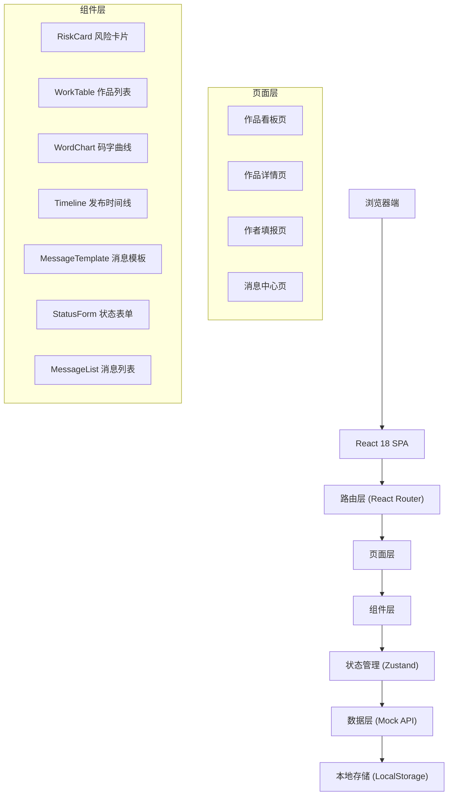
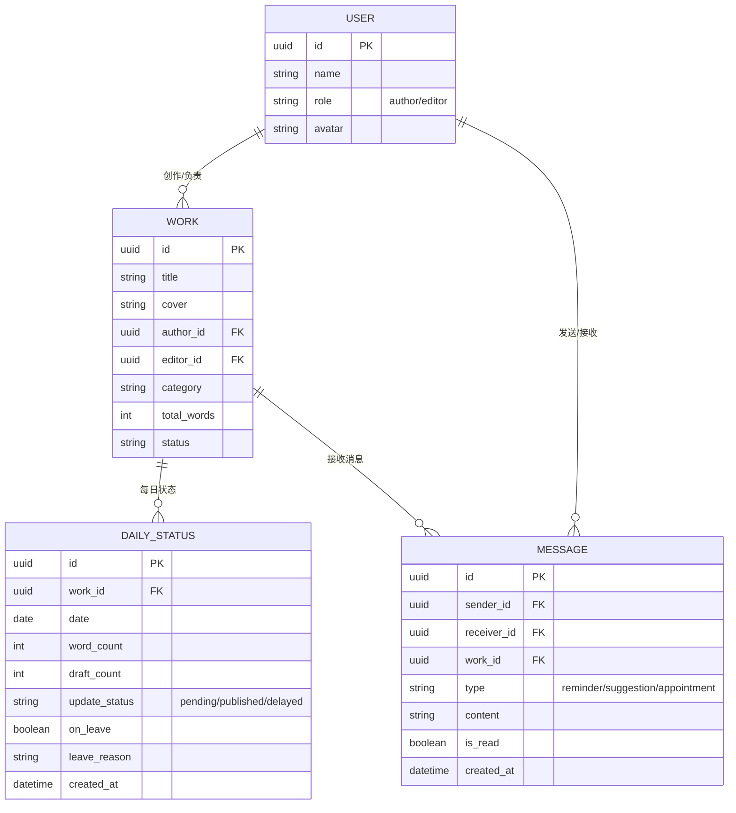

## 1. 架构设计



## 2. 技术描述

- **前端框架**：React 18 + TypeScript
- **构建工具**：Vite 5
- **样式方案**：TailwindCSS 3
- **路由管理**：React Router DOM 6
- **状态管理**：Zustand 4
- **图表库**：Recharts 2
- **图标库**：Lucide React
- **后端**：Express 4（用于 API Mock）
- **数据持久化**：LocalStorage + Mock 数据

## 3. 目录结构

```
src/
├── components/          # 可复用组件
│   ├── layout/         # 布局组件
│   ├── RiskCard.tsx
│   ├── WorkTable.tsx
│   ├── WordChart.tsx
│   ├── Timeline.tsx
│   ├── MessageTemplate.tsx
│   └── StatusForm.tsx
├── pages/              # 页面组件
│   ├── Dashboard.tsx
│   ├── WorkDetail.tsx
│   ├── AuthorStatus.tsx
│   └── Messages.tsx
├── store/              # Zustand 状态
│   ├── useWorkStore.ts
│   ├── useMessageStore.ts
│   └── useUserStore.ts
├── types/              # TypeScript 类型
│   ├── work.ts
│   ├── message.ts
│   └── user.ts
├── utils/              # 工具函数
│   ├── mockData.ts
│   ├── riskCalculator.ts
│   └── dateUtils.ts
├── App.tsx
├── main.tsx
└── index.css
```

## 4. 路由定义

| 路由 | 页面 | 访问角色 |
|-------|---------|----------|
| `/` | 重定向到 `/dashboard` | - |
| `/dashboard` | 作品看板 | 编辑 |
| `/work/:id` | 作品详情 | 编辑 |
| `/author/status` | 作者状态填报 | 作者 |
| `/messages` | 消息中心 | 作者、编辑 |
| `/login` | 登录页 | 作者、编辑 |

## 5. 数据模型

### 5.1 ER 图



### 5.2 类型定义

```typescript
// user.ts
export type UserRole = 'author' | 'editor';

export interface User {
  id: string;
  name: string;
  role: UserRole;
  avatar: string;
}

// work.ts
export type RiskLevel = 'green' | 'yellow' | 'red';
export type UpdateStatus = 'pending' | 'published' | 'delayed';

export interface Work {
  id: string;
  title: string;
  cover: string;
  authorId: string;
  editorId: string;
  authorName: string;
  category: string;
  totalWords: number;
  status: 'ongoing' | 'completed';
  riskLevel: RiskLevel;
}

export interface DailyStatus {
  id: string;
  workId: string;
  date: string;
  wordCount: number;
  draftCount: number;
  updateStatus: UpdateStatus;
  publishTime?: string;
  onLeave: boolean;
  leaveReason?: string;
  createdAt: string;
}

// message.ts
export type MessageType = 'reminder' | 'suggestion' | 'appointment';

export interface Message {
  id: string;
  senderId: string;
  receiverId: string;
  workId: string;
  workTitle: string;
  type: MessageType;
  content: string;
  template: string;
  isRead: boolean;
  createdAt: string;
}
```

### 5.3 消息模板

| 类型 | 模板内容 |
|------|----------|
| 温和提醒 | 「您好，注意到《{workTitle}》近日更新节奏有所放缓，目前存稿 {draftCount} 章。建议合理安排时间，如有困难随时沟通~」 |
| 补更建议 | 「建议：1) 先发一章番外稳住读者 2) 将长章拆分为两章发布 3) 提前发单章说明情况。您可以根据实际情况选择~」 |
| 沟通预约 | 「关于《{workTitle}》的后续更新计划，想和您约个时间沟通一下。请问您本周什么时间段方便呢？」 |

## 6. 风险计算规则

```typescript
// riskCalculator.ts
export function calculateRiskLevel(statuses: DailyStatus[]): RiskLevel {
  const today = statuses[statuses.length - 1];
  
  // 红色风险：今日预计无法准时发布
  if (today && today.updateStatus === 'delayed') {
    return 'red';
  }
  
  // 黄色风险：存稿不足3章 或 近三天字数下滑
  if (today && today.draftCount < 3) {
    return 'yellow';
  }
  
  if (statuses.length >= 3) {
    const recent = statuses.slice(-3);
    const isDeclining = recent.every((s, i) => 
      i === 0 || s.wordCount < recent[i - 1].wordCount
    );
    if (isDeclining && recent[0].wordCount > 0) {
      return 'yellow';
    }
  }
  
  // 绿色稳定
  return 'green';
}
```

## 7. Mock 数据设计

- 预置 15 部作品数据，覆盖红黄绿三种风险等级
- 每部作品生成最近 7 天的 DailyStatus 数据
- 预置 10 条消息数据，包含不同类型和状态
- 预置 2 个编辑账号、15 个作者账号

